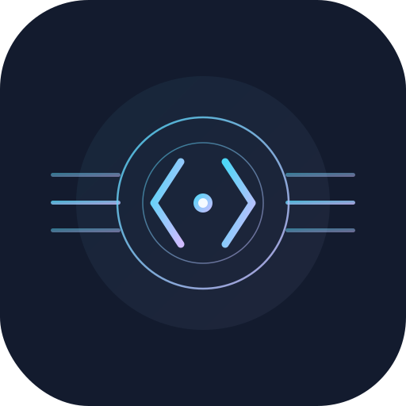

# FreeAI-Gateway

<p align="center">
  
</p>

<p align="center">
  
  
  <br>
  <a href="https://react.dev/"></a>
  <a href="https://www.typescriptlang.org/"></a>
  <a href="https://expressjs.com/"></a>
  
</p>

<p align="center">
  <strong>基于 <a href="https://github.com/xiaoY233/Chat2API">Chat2API</a> 的 Web 版本 — 无需 Electron，直接部署运行</strong>
</p>

---

## 原项目

本项目 Fork 自 **[xiaoY233/Chat2API](https://github.com/xiaoY233/Chat2API)**，原作者 **xiaoY233**。

原项目是一个基于 Electron 的桌面应用，将 DeepSeek、GLM、Kimi、MiniMax、Qwen、Z.ai 等官方 Web UI 逆向封装为 OpenAI 兼容 API。感谢原作者的出色工作。

---

## 本版本的改进

### 🚀 架构升级：桌面 → Web 服务

| | 原版（Electron） | 本版（Web Edition） |
|---|---|---|
| 运行方式 | 桌面客户端 | HTTP 服务，浏览器访问 |
| 部署 | 下载安装包 | `npm start`，支持服务器部署 |
| 跨平台 | 需要打包不同平台安装包 | 任意有 Node.js 的环境 |
| 资源占用 | Electron 进程较重 | 纯 Node.js，轻量 |
| 远程访问 | ❌ 仅本机 | ✅ 可通过网络访问 |

### 🎨 UI 全面重设计：Liquid Glass 风格

原版使用标准 shadcn/ui 组件，本版完全重写界面风格：

- **Liquid Glass 视觉语言**：深色毛玻璃卡片，`backdrop-blur`，微光边框，统一 cyan 主色调
- **仪表盘**：实时统计卡片 + 真实数据折线图（总计/成功/失败三线），供应商状态网格
- **供应商管理**：账号卡片 glass 行式布局，状态徽章，能力标签（文本/多模态/图像/深度思考）
- **日志页面**：趋势折线图卡片 + glass 表格，完整请求详情
- **API 密钥页面**：统计卡片 + glass 表格 + 安全提示
- **设置页面**：Tabs 布局，glass 圆角卡片，统一颜色系统
- **全局 Dialog**：圆角 glass 风格，统一按钮样式

### 📊 数据可视化升级

- 仪表盘和日志页面的趋势图接入**真实后端数据**（`/api/logs/trend`）
- 原版趋势图为静态占位，本版实时反映请求量变化
- 折线图显示总计、成功、失败三条曲线，hover 显示具体数值

### 🔧 功能修复与增强

- **GLM**：非流式模式正确返回图片 URL；对话后自动删除会话
- **Qwen**：修复 `handleStream` 第二参数导致的空响应；非流式 `tool_calls` 去重
- **MiniMax**：适配新版 API 格式（标准 OpenAI SSE）；uuid/user_id 分离
- **Kimi/DeepSeek/Qwen/Perplexity**：对话结束后自动清理会话，避免页面积累历史
- **DeepSeek**：修复 WASM 导出函数名变更导致的 Challenge 失败
- **Zai**：完整适配器接入，model mapping，features 字段精简
- **工具调用**：修复流式 `[function_calls]` 分块导致的重复 emit
- **单端口架构**：前后端统一端口，`.env` 控制开发端口，无硬编码
- **账号状态**：更新 credentials 后自动验证有效性

---

## 功能特性

- ✅ **OpenAI 兼容 API**：标准 `/v1/chat/completions` 接口，无缝接入 Cherry Studio、Kilo Code、Cline 等
- ✅ **多供应商支持**：GLM、Kimi、Qwen、MiniMax、Z.ai、DeepSeek、Perplexity
- ✅ **多轮对话**：完整会话管理，上下文保留
- ✅ **Function Calling**：通用工具调用，prompt engineering 实现，兼容所有模型
- ✅ **流式输出**：SSE 实时流式响应
- ✅ **图像生成**：GLM cogview，图片 URL 正确返回
- ✅ **模型映射**：灵活的模型名称映射，支持通配符
- ✅ **API Key 管理**：多 Key 轮询，权限控制
- ✅ **实时监控**：请求趋势图、成功率、延迟统计
- ✅ **Web 部署**：无需桌面环境，服务器直接运行

---

## 快速开始

### Docker 部署（推荐）

```bash
# 克隆项目
git clone https://github.com/spf0209/FreeAI-Gateway.git
cd FreeAI-Gateway

# 1. 构建前端
cd web/client && npm install && npm run build && cd ../..

# 2. 构建 Docker 镜像
docker build -f web/Dockerfile -t freeai-gateway:latest .

# 3. 启动容器（端口 3013）
docker compose -f web/docker-compose.yml up -d
```

访问 `http://localhost:3013` 即可。

> 数据持久化在 Docker volume `chat2api_data`，容器重建不丢失。

### 本地开发

**要求：** Node.js 18+

```bash
# 安装依赖
cd web/server && npm install
cd ../client && npm install

# 启动后端（端口 3000，同时 serve 前端静态文件）
cd web/server && npm run dev

# 开发模式同时启动前端热更新（可选，端口 3013）
cd web/client && npm run dev
```

### 更新部署

```bash
# 拉取最新代码
git pull

# 重新构建前端
cd web/client && npm run build && cd ../..

# 重新构建镜像并重启
docker build -f web/Dockerfile -t freeai-gateway:latest .
docker compose -f web/docker-compose.yml up -d --force-recreate
```

---

## 供应商状态

| 供应商 | 对话 | 工具调用 | 图像生成 | 状态 |
|--------|------|----------|----------|------|
| GLM (智谱清言) | ✅ | ✅ | ✅ cogview | 稳定 |
| Kimi | ✅ | ✅ | — | 稳定 |
| Qwen (通义千问国内版) | ✅ | ✅ | — | 稳定 |
| Qwen AI (国际版) | ✅ | ✅ | — | 稳定 |
| MiniMax | ✅ | — | — | 稳定 |
| Z.ai | ✅ | — | — | 阿里云验证码拦截 |
| DeepSeek | ✅ | — | — | 稳定 |
| Perplexity | ✅ | — | — | 不稳定（Cloudflare 拦截） |

> Token 有效期因平台而异，过期后在管理界面更新即可。

---

## License

GPL-3.0 — 与原项目保持一致。

本项目基于 [xiaoY233/Chat2API](https://github.com/xiaoY233/Chat2API) 开发，感谢原作者的贡献。
